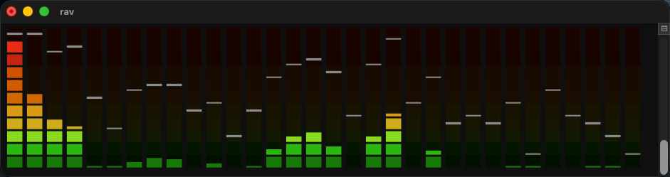

<div align="center">

# rav

**Rust audio visualiser** — a real-time spectrum analyser with a retro look.

Bars, peak caps and an oscilloscope, in truecolour.
Terminal today, GUI next.



[](https://crates.io/crates/rav)
[](https://crates.io/crates/rav)
[](https://www.rust-lang.org)
[](https://github.com/i-am-logger/rav/actions/workflows/ci.yml)
[](https://docs.rs/rav)

[](https://nixos.org)
[](https://devenv.sh)
[](docs/audio.md)
[](docs/audio.md)
[](LICENSE)

</div>

---

## Install

```
nix run github:i-am-logger/rav      # no install
cargo install rav                   # needs alsa-lib and pkg-config on Linux
```

Or from source: `cargo build --release && ./target/release/rav`.

## Usage

```
rav                   # analyser
rav --theme winamp    # rav, winamp, terminal, mono, or a path to a theme
rav --list-devices    # what rav can capture from
rav -d "<name>"       # capture from a named device
rav --clean           # log almost nothing
rav --surface kitty   # auto, glyphs, kitty or window
```

`--surface` only reports for now. Press `h` and rav tells you which surface it
would draw on and why; block characters draw the picture either way.

Everything else is a keypress, and `h` shows the lot with their current values:

| Key | |
|---|---|
| `q` / `Esc` | quit |
| `Space` / `Tab` / `o` | switch analyser ↔ oscilloscope |
| `t` | theme — rav, winamp, terminal, mono |
| `b` | bar style — blocks, solid, thick, half, line, shade |
| `p` | peak caps — fine, coarse, off |
| `g` | grid behind the bars, on/off |
| `w` | bandwidth: wide (grouped) or thin |
| `f` | bar fall speed — 3, 6, 12, 16, 32 |
| `r` | frequency range — 8/12/16/20 kHz or full |
| `↑` / `↓` | gain trim, `0` resets |
| `+` / `-` | bar size |
| `h` / `?` | help |

Logs go to `rav.log`, never to the display.

## Themes

Four, cycled with `t` and all compiled in — the binary needs nothing on disk:

| | |
|---|---|
| **rav** *(default)* | the classic ramp, over a backdrop of its own colours dimmed |
| **winamp** | the faithful reproduction of the original: one flat dim backdrop |
| **terminal** | the terminal's own 16 colours, so rav follows your theme |
| **mono** | greys only; height alone carries the level |

A theme is a TOML file, not code — `rav --theme ./sunset.toml`. See
**[docs/themes.md](docs/themes.md)** and send one.

## Capturing system audio

Nothing to install — see **[docs/audio.md](docs/audio.md)**. If it stays silent,
**[docs/troubleshooting.md](docs/troubleshooting.md)**.

## Building and hacking on it

See **[docs/developing.md](docs/developing.md)**.

## Attribution

The ballistics, and the ramp the `rav` and `winamp` themes use, come from
[Webamp](https://github.com/captbaritone/webamp) — MIT, © 2015 Jordan Eldredge.

## What's next

Pixels instead of block glyphs, a GUI, and small displays. The mechanics and the
themes live in two `no_std` crates that know nothing about terminals — so the
same bars, in the same colours, can be drawn to a window or to a strip of LEDs.

## License

CC BY-NC-SA 4.0 — see [LICENSE](LICENSE).
