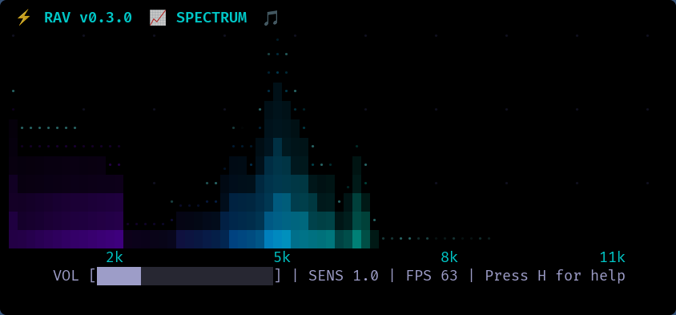

# RAV - Rust Audio Visualizer

Minimal, terminal-based audio visualizer built with Rust and ratatui.

## Screenshot

This is what RAV looks like in action:



## Develop

Using Nix (recommended):

```
git clone git@github.com:i-am-logger/rav.git
cd rav
nix develop
```

Without Nix:
- Install Rust (stable) and system deps: ALSA, PulseAudio dev headers, pkg-config, gcc.

## Run

- Debug:
```
cargo run --bin rav
```
- Release:
```
cargo build --release
./target/release/rav
```

## Tests
```
cargo test
```

## License
See LICENSE.
