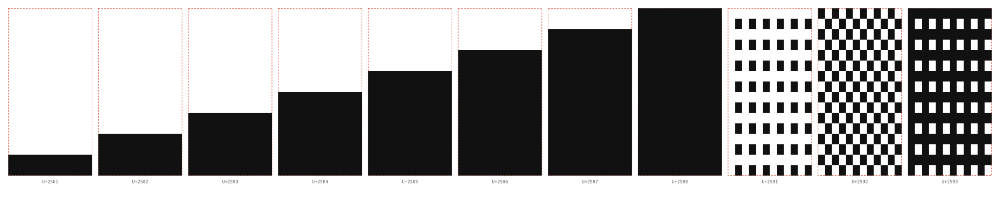

# The block glyphs, and why they are not the skin

Traced from the font's own outlines: the eight eighth-height blocks `▁▂▃▄▅▆▇█`,
then `░▒▓`. Each sits in a dashed box showing the cell it is drawn into.

## What it is for

Two things draw these glyphs, and they disagree.

**The font** draws `░▒▓` as genuine dithers — the figure above shows `U+2591` as
a grid of small separated squares, because that is what the outline contains.

**WezTerm does not consult the font at all.** `custom_block_glyphs` defaults to
true, so it synthesises the block characters itself, and it renders `░▒▓` as the
whole cell at flat 25/50/75% alpha. Verified with `wezterm ls-fonts --text`.

So the picture above is what the *font* would draw, and on the terminal most rav
users run it is not what appears.

## Why that matters for skins

A skin has a shape per level, and the obvious way to author one is to trace this
figure. **Do not.** A skin traced from the font would make the first pixel
release differ from the glyph release it is meant to reproduce — dithered shades
against flat ones — and the difference would read as a rendering bug rather than
as the deliberate change it was.

Skin shapes come from WezTerm's `customglyph.rs`: eighth blocks are full-width
rectangles from `(8-n)·h/8`, and `░▒▓` are the whole cell at flat alpha.

## Where they went

The six built-in ladders now live in `rav-appearance`'s `skin::ladders`, as
fractions of a rung rather than artwork:

| style | rung |
|---|---|
| `blocks` `█` | the whole rung |
| `shade` `▓` | the whole rung at 0.75 opacity — flat, per the above, not a dither |
| `solid` `▇` | the lower seven eighths |
| `thick` `▆` | the lower three quarters |
| `half` `▄` | the lower half |
| `line` `━` | an eighth in the middle, floating |

Numbers rather than SVG because every one of them is a rectangle or a fraction
of one. That keeps them on a target with no parser, no filesystem and no
allocator — the same reason the themes are generated `const`s. Artwork is for
skins that are actually drawings, and brings `usvg` with it when it arrives.

This file stays as documentation of the other half of the story, and as the
reason issue #63 looks different on Linux and macOS: the terminal, not the font,
decides.
